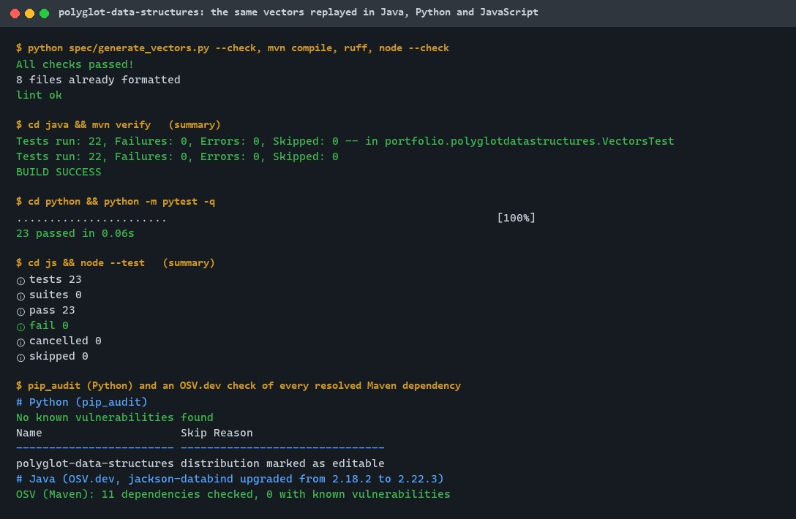
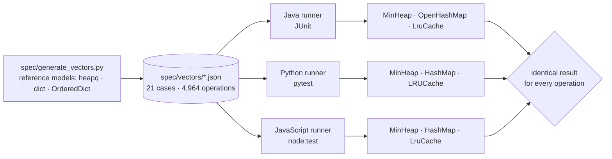
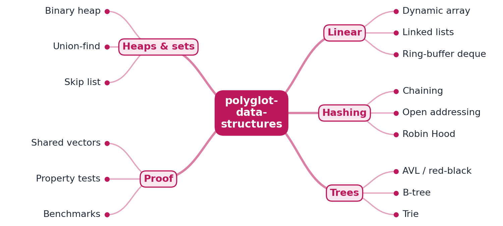
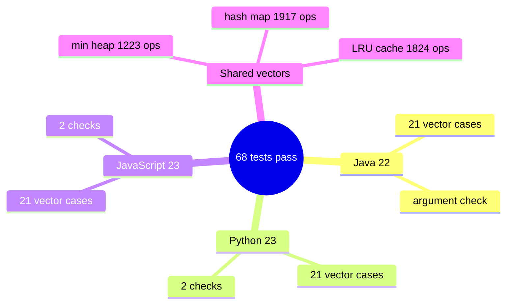

# polyglot-data-structures

[](https://github.com/EquinoxWN/polyglot-data-structures/actions/workflows/ci.yml)


> One test suite, three languages: a min-heap, a hash map and an LRU cache written in Java, Python and JavaScript, all replaying the same language-neutral test vectors to prove they behave identically.

Part of my **CS Foundations** list · Java · Python · JS · core project

## Proof it works

The same test vectors replayed in all three languages, after checking that the vectors are up to date: 22 Java, 23 Python and 23 JavaScript tests pass. Dependencies have no known vulnerabilities (the Java test dependency was upgraded during this check):



## Architecture

**What M1 runs today:**



**Full roadmap (M1 to M3):**



## How it works

_Steps 1 and 2 are built and tested (M1); the rest is on the [roadmap](#roadmap)._

1. Each structure has one language-neutral spec: a JSON file of operation sequences and expected results, run by a small runner in each language.
2. All three implementations must pass the same vectors, so a bug in one language is caught by the spec, not by luck.
3. Property-based tests generate random operation sequences and check invariants such as red-black balance and heap order.
4. Benchmarks in each language's standard harness measure operations per second at several sizes.
5. The README explains what textbooks skip: why a cache-friendly B-tree or open addressing often beats pointer-heavy structures at equal Big-O.
6. Each implementation is compared with its standard library (java.util, Python dict, JS Map) to show where hand-written code loses, and why.

## Who it helps

- **Who:** Developers who port code between Java, Python and JavaScript, and learners comparing the languages.
- **The problem:** Implementations of the same structure in different languages drift apart in behaviour.
- **How to use it:** Replay the language-neutral JSON test vectors for the min-heap, hash map and LRU cache in all three languages, and add vectors when you add behaviour.

## Tech stack

| Area | In M1 | Planned |
|---|---|---|
| Code | Java 21, Python 3.11+, JavaScript on Node.js 24 | More structures (balanced trees, B-tree) |
| Tests | Shared JSON test vectors; JUnit, pytest, node:test | Property tests: jqwik, Hypothesis, fast-check |
| Bench | - | JMH, pyperf, mitata |

Languages: **Java 21 · Python 3.11+ · JavaScript (Node 24)**, one folder each, driven by one shared spec.

| Path | What it is |
|---|---|
| `spec/vectors/*.json` | Language-neutral test vectors: operations and expected results |
| `spec/generate_vectors.py` | Builds the vectors from `heapq` / `dict` / `OrderedDict` reference models |
| `java/` | `MinHeap`, `OpenHashMap`, `LruCache` + JUnit runner |
| `python/` | `MinHeap`, `HashMap`, `LRUCache` + pytest runner |
| `js/` | `MinHeap`, `HashMap`, `LRUCache` + node:test runner |

## Run it

```bash
make setup   # install the Python package in editable mode
make lint    # vectors are fresh, Java compiles, ruff, node --check
make test    # replay every vector in Java, Python and JavaScript
make vectors # regenerate spec/vectors after changing the generator
```

Or one language at a time:

```bash
cd java && mvn verify
cd python && python -m pytest
cd js && node --test
```

## Tests and results

Latest local run (full detail in [docs/results/m1.md](docs/results/m1.md)):

| Check | Result |
|---|---|
| Shared vectors | 21 cases, 4,964 operations (min-heap, hash map, LRU cache) |
| Java (JUnit) | 22 passed, 0 failed |
| Python (pytest) | 23 passed, 0 failed |
| JavaScript (node:test) | 23 passed, 0 failed |
| Vectors match the reference generator | yes (`--check`) |

All three languages return identical results for every operation. CI re-runs this on every push.

### Test map



## Roadmap

**M1** (≈15 h)
- [x] Write `docs/rfc/0001-design.md`: problem, goals, non-goals, chosen design
- [x] Each structure has one language-neutral spec: a JSON file of operation sequences and expected results, run by a small runner in each language.
- [x] All three implementations must pass the same vectors, so a bug in one language is caught by the spec, not by luck.

**M2** (≈20 h)
- [ ] Property-based tests generate random operation sequences and check invariants such as red-black balance and heap order.
- [ ] Benchmarks in each language's standard harness measure operations per second at several sizes.

**M3** (≈25 h)
- [ ] The README explains what textbooks skip: why a cache-friendly B-tree or open addressing often beats pointer-heavy structures at equal Big-O.
- [ ] Each implementation is compared with its standard library (java.util, Python dict, JS Map) to show where hand-written code loses, and why.
- [ ] Publish the proof below with real numbers

## Proof

What this repo must show before it counts as done:

- Three-language benchmark tables and a cache-effects write-up backed by measurements.

| Result | Value |
|---|---|
| M3 proof above | Not measured yet (M3). Current M1 numbers: see [Tests and results](#tests-and-results). |

## Why it matters

- **Interview angle:** LRU-cache and ordered-map coding rounds, plus 'how does your language's hash map actually work?'
- **Upstream I'd like to contribute to:** OpenJDK or CPython: collection-related issues tagged for new contributors.

## Design docs

- [RFC 0001: design](docs/rfc/0001-design.md)
- [ADR 0001: record architecture decisions](docs/adr/0001-record-architecture-decisions.md)
- [ADR 0002: generate expected results from standard-library reference models](docs/adr/0002-vectors-from-reference-models.md)

## Scope

This is a learning and portfolio system, not a hosted production service. Everything runs locally.

## Security and contributing

- Every GitHub Action is pinned to a commit SHA; workflows run read-only, without persisted credentials.
- Dependabot proposes dependency and action updates weekly.
- `ruff` with security (bandit) rules and `ruff format --check` on every push; `pip-audit` and OSV-Scanner on a CycloneDX SBOM of the Maven dependencies (`make audit`) in CI.
- Report vulnerabilities privately: see [SECURITY.md](SECURITY.md). To contribute, see [CONTRIBUTING.md](CONTRIBUTING.md).

## License

MIT, see [LICENSE](LICENSE).
